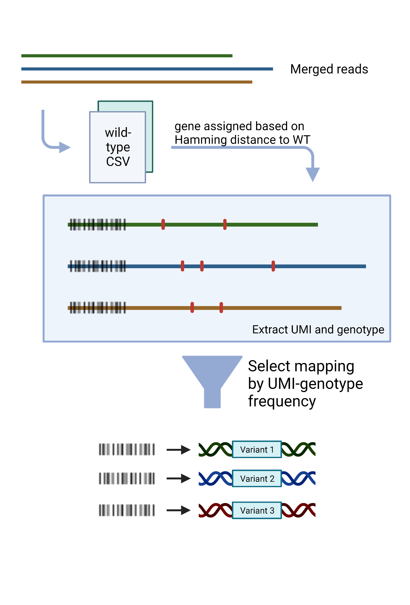
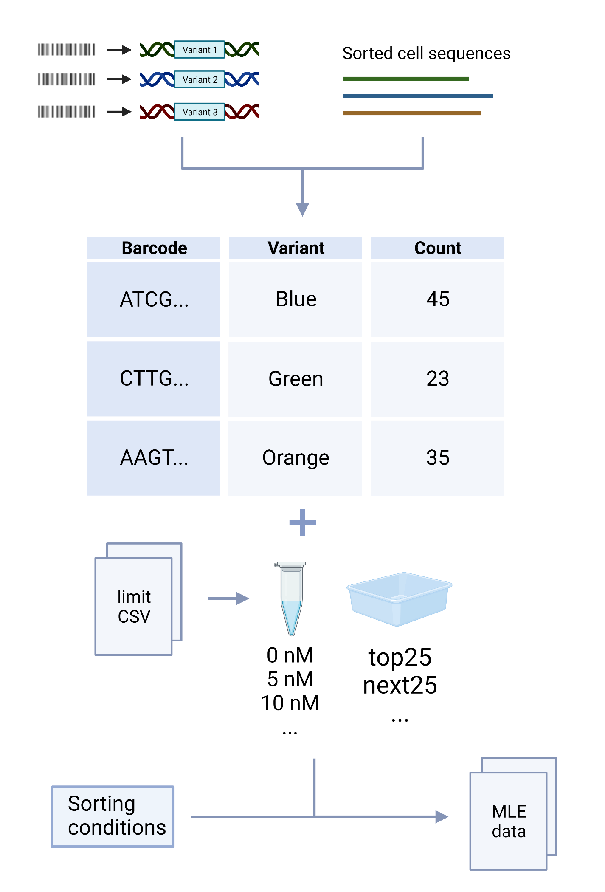
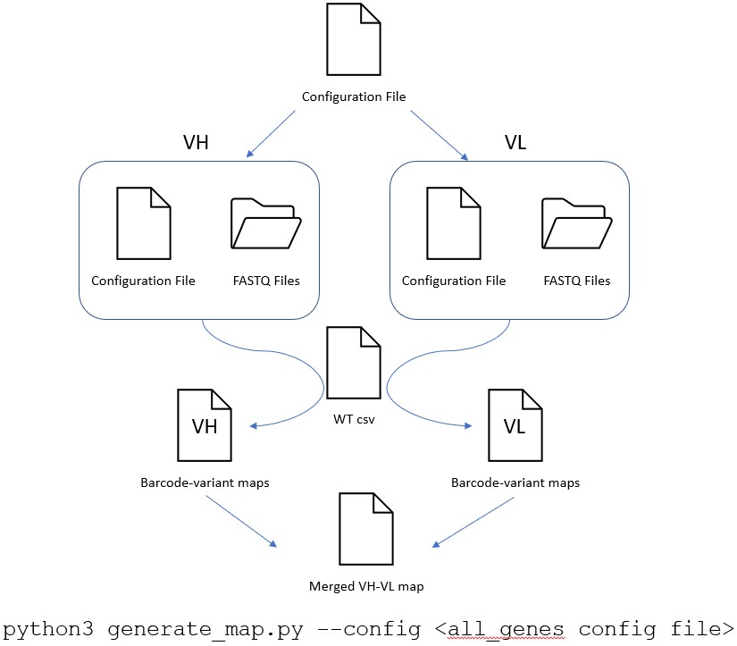

# Fab Library Barcoding

README Updated: September 10, 2023

## CONTENTS: ##
1. About
2. Running the code
3. Notes
4. Requirements

## 1. About ##

This repository contains code for haplotyping and Maximum Likelihood Estimation (MLE) of barcoded Fab libraries as presented in _An integrated platform for quantitative wide mutational scanning of human antibody Fab libraries_. Includes sample sequencing files for testing.

## 2. Running the code ##

### Wild-type CSV ###

The sequencing analysis section of the code can be run in two ways: with or without barcoding. If the config file contains a barcoding section, the code will run the barcoding analysis. See test_barcode.config and test.config files for example config files with and without barcoding, respectively.

To run the haplotyping protocol: `$ python3 main.py --config <path to haplotyping/barcode config>`

To run read merging only: `$ python3 main.py --config <path to merging config>`

To run the scanning/matching protocol: `$ python3 scan_barcode.py --config <path to scanning/matching config>`

To run maximum likelihood estimation (MLE): Use the `MLE_variants.py` or `MLE_barcodes.py` files as templates.

To merge maps for both $V_H$ and $V_L$ genes: `$ python3 merge_vhvl.py <path to VH gene map> <path to VL gene map> <output csv path>`   

To merge reads, haplotype, and merge the $V_H$ and $V_L$ maps: `$ python3 generate_map.py --config <path to config specifying underlying configs>` NOTE: The resulting output map will be named `<SAMPLE NAME>_vhvl.csv`.

For the haplotyping and merging protocols, a csv of parameters for the wild-type sequence is required. Look at `example_wts.csv` in the `examples` folder for reference. Amplicon length, gene start, gene end, barcode start, and barcode end must be specified for both $V_H$ or $V_L$ wild-type sequences.

Each of the config files has a template format given in this repository in the `examples` folder. Each section and parameter in the templates is required for the code to run (though in merging the barcode start and end do not need to be actual starts and ends, and the barcode_min_qual should be 0). 

For scanning, each sample is considered a separate FACS run. The concentration and bin should be specified in the format in the example matching config. A reference sample as specified in the matching config example is required if MLE is to be run on the result.

Samples in both the matching and barcode configs can be removed by commenting using a '#' before the sample definition. For MLE, matching (with `scan_barcode.py`) must be done without any samples that do not have concentration and bin labels.

Merging, haplotyping, and merging the $V_H$ and $V_L$ maps all at once requires a specific config setup. Look at the test_mapping.config in the examples directory for reference. The $V_H$ and $V_L$ samples you want to be merged together need to be "paired up" across configs in the samples section. For example, note that the VL7 and VH8 are on the same row (the first) after the \[Samples\] tag in `all_genes_VL.config` and `all_genes_VH.config`.

A general overview of the pipeline is shown below:

To do an initial run of a $V_H$, $V_L$ paired map, use this script:

  
For using parallel computing on a slurm cluster use the run_mle_blanca.sh bash script.

## 3. Configuration Setup ##

Some configuration examples are provided in the `examples` folder. Two different configuration file types are required for a full run of the pipeline: a barcoding config, and a scanning/matching config. The barcoding config is used for the first step of the pipeline, which is to merge reads and haplotype the sequences. The scanning/matching config is used for the next step of the pipeline, which is to scan the barcodes and match them to the $V_H$ and $V_L$ maps. The MLE step uses parameters defined in the run scripts. As an example, see `MLE_variants.py` or `MLE_barcodes.py`.

To run the barcoding step, it is easiest to provide a separate config file that specifies both the $V_H$ and $V_L$ sequencing files and how they should be merged. An example is given in `all_maps.py`, `all_genes_VH.py`, and `all_genes_VL.py`.

The config file for the barcoding step should have the following sections:

| Section  | Description |
|---|---|
| \[Parameters\] | Contains use_multiprocessing, max_mismatches, gene_min_quality, and min_quality options. Additionally, specifies both the FASTQ (or gzipped FASTQ) file input directory and the output directory. gene_min_quality is the minimum quality for the gene sequence, and min_quality is the minimum quality for the entire sequence. |
| \[Barcode\] | Specifies the barcode sequence, barcode_min_quality, and vh_or_vl. The barcode sequence is the template sequence in mixed-base notation of the barcode, and the barcode_min_quality is the minimum quality for the barcode sequence. The vh_or_vl parameter specifies whether the barcode is for the $V_H$ or $V_L$ gene. This section also takes the wild-type CSV, an example of which is available in the `examples` directory. Lastly, this section provides a few additional options: count and frequency thresholds for choosing variants correctly in mapping UMIs to variants, and options to remove silent mutations as well as non-encoded positions. |
| \[Samples\] | Specifies the sample name and the forward and reverse read FASTQ files. If using a config alongside `generate_map.py`, these should be aligned in both $V_H$ and $V_L$ configs so that the merging of $V_H$ and $V_L$ will work properly. |
| \[Experiments\] | Specifies the experiment name and the samples that should be included in that experiment. |
| \[Proteins\] | Essentially a replica of Experiments, used for backwards compatibility with the code from [Haas et al.](https://www.sciencedirect.com/science/article/pii/S266616672100575X?via%3Dihub) |

For the matching config, the following sections are required:

| Section  | Description |
|---|---|
| \[Parameters\] | Contains the use_multiprocessing option. Additionally, this is where the map file, sorted cell sequencing files, output directory, barcode template, and barcode start location are specified. The limit CSV, which contains information on sorting conditions, must be included here also. |
| \[Samples\] | Specifies the sample name and the sorted cell sequencing file. If the sample is from a specific concentration and bin, it must be specified in the following format: `conc5nM_bintop25` where the 5nM and top25 are the respective concentration and bin of that sample. |

## 4. Notes ##

- Must add new output_dir name in config file for each new sequencing run.
- Positions in DNA are 0 indexed, positions in protein sequence are 1 indexed.
- Code outputs merged files into csv and detects merged sequences if output_dir already exists.
- Coding sequence must be input as forward read.
- If using already merged files, make sure that the "merged.csv" is in the output directory for that sample.
- The sequence indices do not include the last index, so to get the end index you should add the length of the barcode to the start index.
- encoded_positions is not specific to $V_H$ or $V_L$. This should generally not be a problem, but (for example) if there is a non-encoded mutation on $V_L$ that exactly matches one that is encoded on $V_H$ it will not get removed from the data.

Filtering occurs in these steps:
| Name  | Filter  | Optional  | Comments |
|---|---|---|---|
| max_mismatches  | Mismatches in merge overlap region | Yes  | Number of allowed mismatches is specified in the barcoding or merging config.  |
| min_quality  | Minimum quality | Yes | Minimum quality is specified in the barcoding or merging config. |
| barcode_min_quality  | Minimum barcode quality  | Yes  | Minimum barcode quality is specified in the barcoding config.  |
| gene_min_quality  | Minimum gene quality  | Yes  | Minimum gene quality is specified in the barcoding config.  |
| No N basecalls  | Remove merged reads with N basecalls  | No |   |
| Hamming distance filter  | Filter out reads farther than a certain Hamming distance in the gene segment  | Yes |   |
| Barcode sequence filter  | Remove reads that do not match the defined barcode sequence (which is defined in mixed base notation)  | Yes | Barcode sequence is specified in the barcoding config (barcode).  |
| Count threshold  | Remove variants below a certain specified number of counts  | Yes | The count filter threshold is defined in the barcode config (count_threshold). This is also available for the deep mutational scanning portion of this code, and can be configured by setting min_ref_counts in the parameters section of the DMS config.  |
| Frequency threshold  | Remove variants below a certain frequency threshold  | Yes | The frequency filter threshold is defined in the barcode config (frequency_threshold). This is using the frequency in the original population. *NOTE:* If your code is not merging the VH and VL maps due to a missing DataFrame key, this is probably set too high. |
| Remove silent mutations  | Remove silent mutations from the mutation representation (e.g. M83I-ATC;T119T-ACT -> M83I-ATC;)  | Yes | To remove silent mutations, set the mutations parameter in the \[Barcode\] section of the barcode config to "non-silent" |
| Remove non-encoded mutations  | Remove variants that include non-encoded mutations  | Yes | The encoded positions are defined using a list in the WT CSV file for each gene. (e.g. encoded_positions for 4A8: "M59I;Q120K;S7T;T94M;V109L;D110E"). This list should be in that exact format, separated by semicolons. Additionally, the encoded_positions argument in the \[Barcode\] section of the barcode config should be set to True.  |

## 4. Requirements ##

- Python 3.7+
- Python packages and versions contained in the environment.yaml file

To install from the yaml file, run `$ conda env create -n <env_name> --file environment.yaml`
